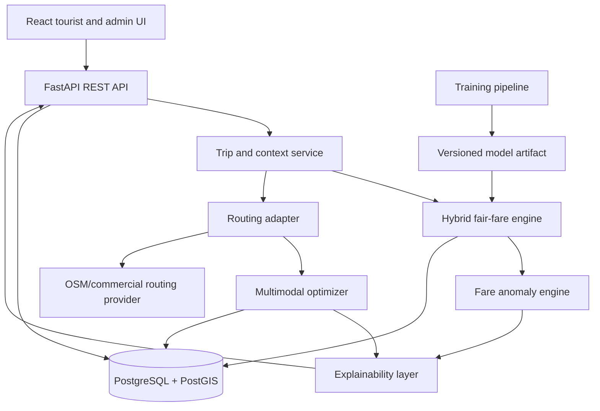

# Phase 1 Foundation

## A. Final architecture

### Product boundary

Smart Tourist Mobility is a decision-support system. It estimates a reference fare, compares available travel plans, explains a recommendation, and flags an unusually high quote. It does not accept bookings, process payments, claim live traffic accuracy, or accuse a driver of fraud.

### Logical flow



### Recommended modules

- `backend/app/api`: request validation and HTTP responses only.
- `backend/app/services`: trip orchestration, fare, anomaly, and recommendation use cases.
- `backend/app/domain`: transport, fare, route, and preference models.
- `backend/app/integrations/routing`: provider adapters with one internal route contract.
- `backend/app/optimization`: configurable weighted scoring and route filtering.
- `backend/app/ml`: model loading and inference boundary; training stays under `ml/`.
- `backend/app/db`: SQLAlchemy models, repositories, and migrations.
- `frontend/src`: planner, comparison, fare check, map, summary, and dashboard views.
- `ml`: reproducible preprocessing, model comparison, evaluation, and Joblib artifacts.

### MVP request flow

1. The planner validates Hyderabad locations, passenger count, budget, walking tolerance, and preference.
2. The route adapter obtains candidate legs from a configured provider or clearly labelled demo fixture.
3. The fare engine combines official/public rules and a validated ML estimate where data is available.
4. The optimizer filters inaccessible or over-budget candidates, then scores cost, time, walking, transfers, and emissions using named preference profiles.
5. The explainability layer returns the selected plan and comparison facts in plain language.
6. A quoted fare is checked against the predicted reference interval and produces a neutral decision-support alert.
7. A traffic context update can trigger a new optimization request; simulated context is labelled as demo data.

### Fare engine contract

The output must include `predicted_fare`, `lower_bound`, `upper_bound`, `currency`, `model_version`, `data_provenance`, and a short `range_method`. The range is an uncertainty interval, not a guarantee.

Initial implementation order:

1. Official/public rule calculation where available.
2. Baseline linear regression.
3. Random Forest and XGBoost comparison.
4. Select the best model by validation evidence, not assumption.
5. Blend or fall back to rules when the model lacks sufficient coverage.

### Optimization contract

Each candidate is a sequence of legs. Every leg carries mode, cost, duration, walking distance, transfers, accessibility, and optional emissions. Preference profiles expose weights and constraints through configuration. The first implementation must log the score components so a recommendation is explainable and testable.

### Non-functional requirements

- Input validation with Pydantic and domain constraints.
- Admin endpoints protected by basic authentication in the MVP.
- Rate limiting at the API edge where deployed.
- No secrets in source control; use `.env` locally and deployment secrets in the runtime environment.
- Structured audit events for admin changes and data imports.
- UTC timestamps in storage; display timezone `Asia/Kolkata` in the UI.
- Request IDs on API responses and logs.

## B. Folder structure

The repository layout is defined in the root README. The first implementation pass should add these subfolders without mixing concerns:

```text
backend/app/{api,core,db,domain,integrations,ml,optimization,services}
backend/tests
frontend/src/{components,pages,features,lib,types}
ml/{data,features,models,training}
data/{raw,processed,samples,schemas}
database/{migrations,seeds}
notebooks
docs
tests/{api,ml,optimization}
docker
```

## C. Database schema

The canonical initial schema is [database/schema.sql](../database/schema.sql). It covers users, locations, transport modes, routes, fare observations, trip requests, fare predictions, route recommendations, and anomaly alerts, with provenance, timestamps, indexes, and PostGIS geometry.

## D. API specification

The MVP contract is [docs/api-specification.md](api-specification.md). The API is versioned under `/api` and keeps routing providers behind an internal adapter boundary.

## E. Dataset schema

The dataset contract is [docs/dataset-schema.md](dataset-schema.md). Every record carries provenance and quality metadata so demo data cannot be confused with official or live data.

## F. Team task allocation

Ownership, file boundaries, PR order, and integration checkpoints are in [docs/team-plan.md](team-plan.md).

## G. Week-by-week implementation plan

The same plan includes entry criteria, deliverables, and exit criteria for each week. The team should not begin the next phase until the previous exit criteria are met.

## Decisions to confirm before coding

- Initial routing provider and its usage limits.
- Which official Hyderabad fare rules can legally and reliably be imported.
- Whether the MVP uses a real PostGIS instance locally or a PostgreSQL-compatible geometry fallback during early tests.
- The exact confidence interval method after baseline experiments.
- The minimum admin authentication mechanism for the demo deployment.
